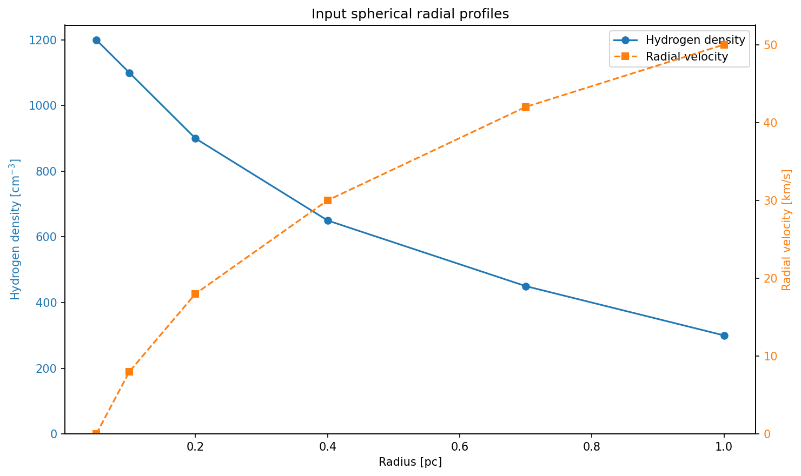
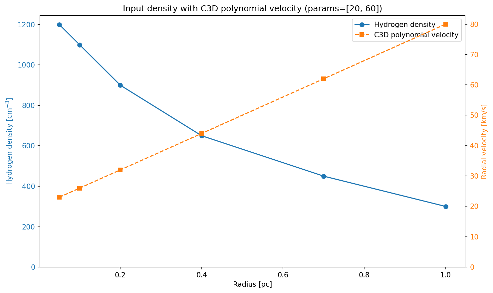
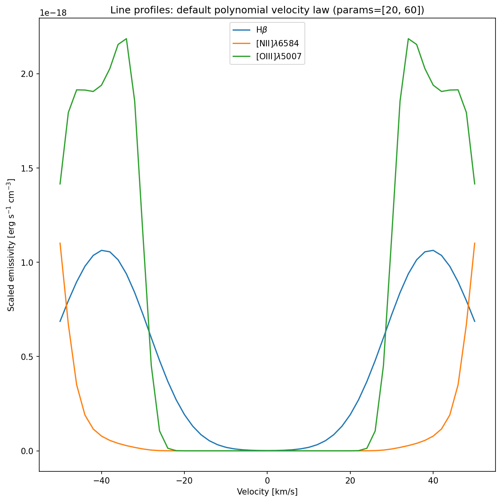
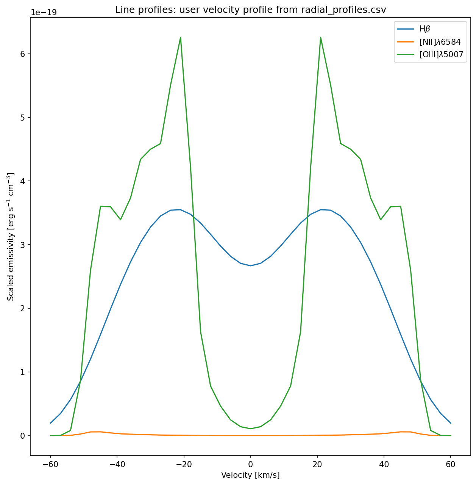
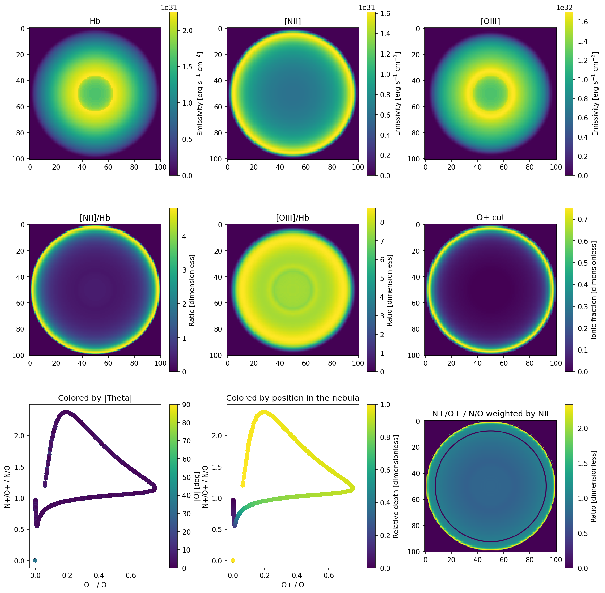
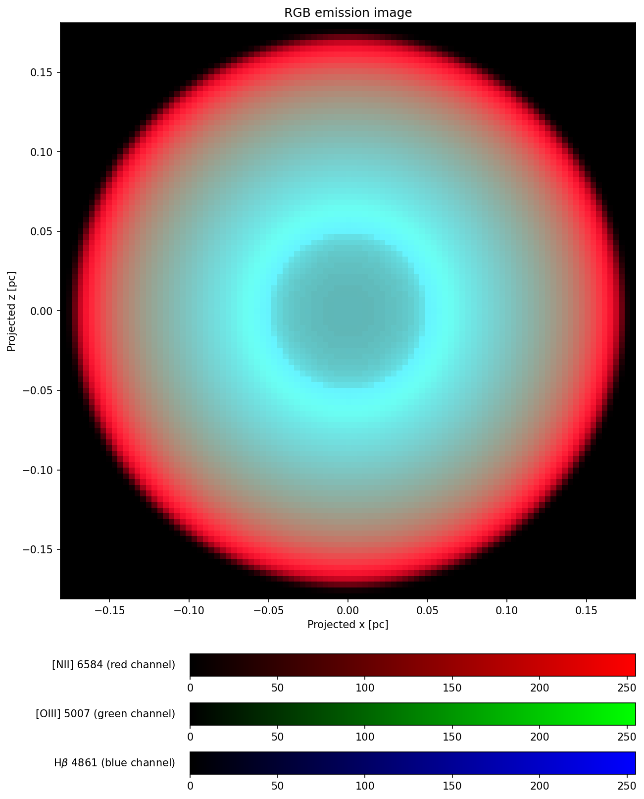
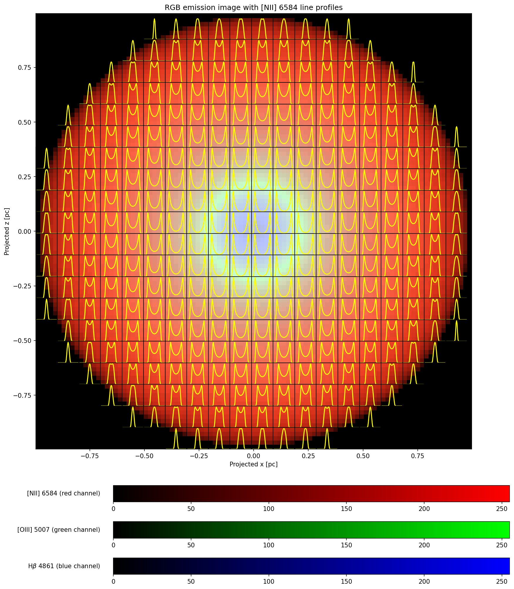
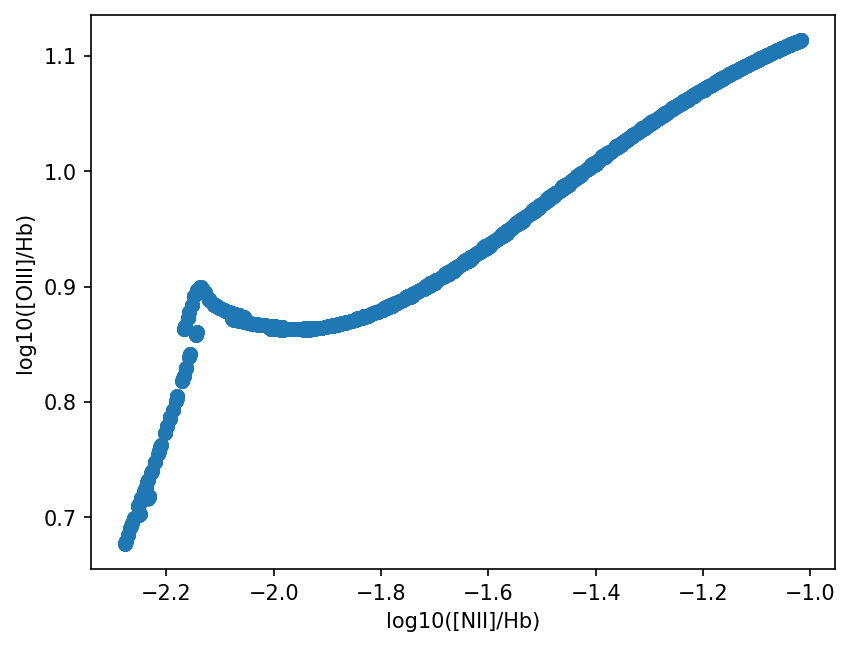

# Spherical Radial Profiles Example

This example extends [`Using_pyCloudy_3`](../python_examples/Using_pyCloudy_3/Using_pyCloudy_3.py)
to a spherically symmetric nebula controlled by external radial profiles.

The example reads:

- radius in pc
- radial velocity in km/s
- hydrogen density in atom cm^-3

from [`radial_profiles.csv`](../python_examples/Using_pyCloudy_3_spherical_profiles/radial_profiles.csv).

## Profile File

The CSV header must contain these exact column names:

```text
RADIUS_PC,VELOCITY_KMS,DENSITY_CM3
```

Example:

```text
RADIUS_PC,VELOCITY_KMS,DENSITY_CM3
0.05,0.0,1200.0
0.10,8.0,1100.0
0.20,18.0,900.0
0.40,30.0,650.0
0.70,42.0,450.0
1.00,50.0,300.0
```

Radius values must be positive and strictly increasing. Density values must be
positive. Velocity values may be positive or negative.

## Running

From the repository root, run:

```bash
python python_examples/Using_pyCloudy_3_spherical_profiles/Using_pyCloudy_3_spherical_profiles.py
```

The example requires a working Cloudy executable and the plotting dependencies
used by pyCloudy. It writes Cloudy model files under `temp_models/` and figures
under `figures/` in the example directory.

## How Profiles Are Used

The density profile is passed to Cloudy with a radial `dlaw table`. Cloudy
interpolates the supplied log-radius/log-density pairs when solving the
spherical model.

The velocity profile is interpolated onto the C3D radius grid and converted to
Cartesian velocity components. The velocity is zero at the origin and is
held at the final supplied value beyond the last profile point.

For the polynomial velocity-law definition and the meaning of its `params`,
see [`C3D.md#polynomial-velocity-law`](C3D.md#polynomial-velocity-law).

## Outputs

The example produces the input profile plot plus the same diagnostic outputs as
the original 3D example:

### Input Profiles





The second input-profile figure keeps the density from `radial_profiles.csv`
but shows the C3D polynomial velocity used for `profile_default.png`.

### Line Profiles





`profile_default.png` uses pyCloudy’s built-in polynomial velocity law with
`params=[20, 60]`. `profile_user_velocity.png` uses the velocity values from
`radial_profiles.csv`, interpolated onto the 3D model grid. Both figures show
the same Hβ, [N II] λ6584, and [O III] λ5007 line profiles, so the difference
is the velocity field used to calculate them.

### Derived Maps



### RGB Images





### Diagnostic Scatter



The RGB figures use `[NII] 6584` for red, `[OIII] 5007` for green, and H-beta
4861 for blue. The RGB-with-profiles figure overlays spatially aligned line
profiles on the projected image; its axes are in pc.
