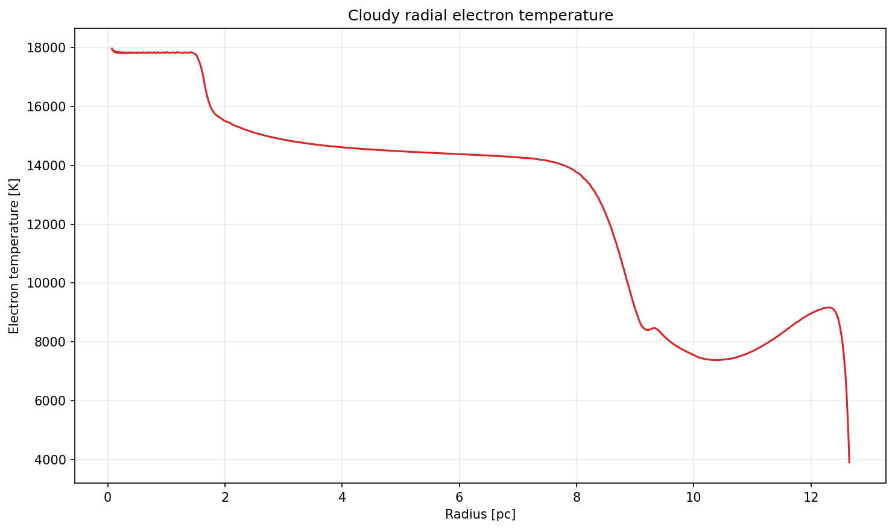
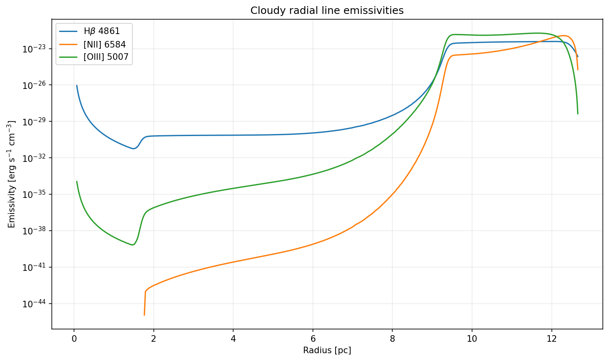

# RHD Stellar-Wind Radial Profiles Example

This example is identical to
[`Using_pyCloudy_3_spherical_profiles_rhd`](../python_examples/Using_pyCloudy_3_spherical_profiles_rhd/Using_pyCloudy_3_spherical_profiles_rhd.py),
but reads
[`radial_profile_rhd_wind.csv`](../python_examples/Using_pyCloudy_3_spherical_profiles_rhd_wind/radial_profile_rhd_wind.csv).

The supplied profile represents a stellar wind with:

```text
Mass-loss rate: 10^-6 Msun/yr
Wind speed:     1000 km/s
```

The CSV is generated by a 1D RHD simulation with this mass-loss rate, wind
speed, and an ionizing photon emission rate of `10^49 s^-1`. This example uses
the simulated temperature, density, and velocity profiles as follows:

The source simulation is the RadHydropy
[`DynamicStromgrenSpherePhotoheating20pcStellarWind1D`](https://github.com/tkc004/RadHydropy/tree/main/example/DynamicStromgrenSpherePhotoheating20pcStellarWind1D)
example.

1. Cloudy preprocesses the RHD density profile and calculates the ionization
   and emission structure using the same `q(H)=10^49 s^-1` source.
2. The simulated velocity profile is interpolated onto the C3D grid.
3. C3D applies that velocity field to construct the 3D structure and calculate
   the line profiles and projected diagnostics.

No Cloudy `wind` command is added. The radial velocity and density fields are
read from the external profile and passed through the same spherical C3D
workflow as the RHD example. The example still includes Cloudy
photoionization, using the same blackbody source and ionizing photon rate as
the RHD profile workflow:

```text
Blackbody temperature: 80000 K
q(H) = 10^49 s^-1
```

For the general photoionization setup, see
[`Using_pyCloudy_3_spherical_profiles_rhd.md`](Using_pyCloudy_3_spherical_profiles_rhd.md).

Only these CSV columns are used:

```text
RADIUS_PC,VELOCITY_KMS,DENSITY_CM3
```

The additional `TEMP_K` column is currently ignored.

## Running

From the repository root:

```bash
python python_examples/Using_pyCloudy_3_spherical_profiles_rhd_wind/Using_pyCloudy_3_spherical_profiles_rhd_wind.py
```

Figures are written under
`python_examples/Using_pyCloudy_3_spherical_profiles_rhd_wind/figures/`.

The input profile figure uses a logarithmic velocity axis with a minimum of
`0.5 km/s`; nonpositive velocity samples cannot be displayed on that axis. The
Cloudy radial temperature and emissivity figures use a linear radius axis.
The user-velocity line profile and the RGB overlay panels show the velocity
range from `-100` to `+100 km/s`.
The script also produces Cloudy-output radial profiles for electron
temperature and the Hβ 4861, [N II] 6584, and [O III] 5007 emissivities.




