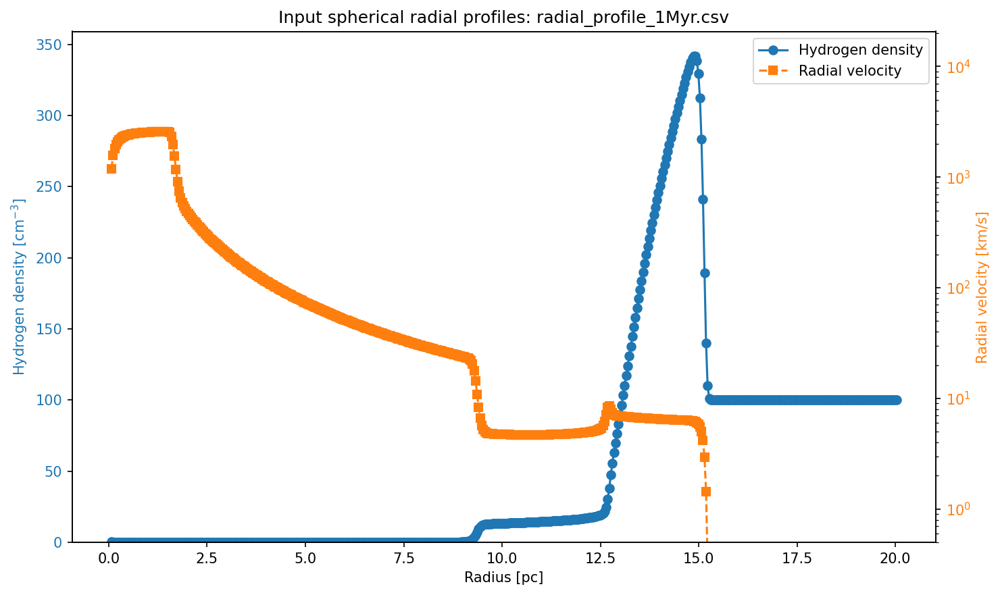
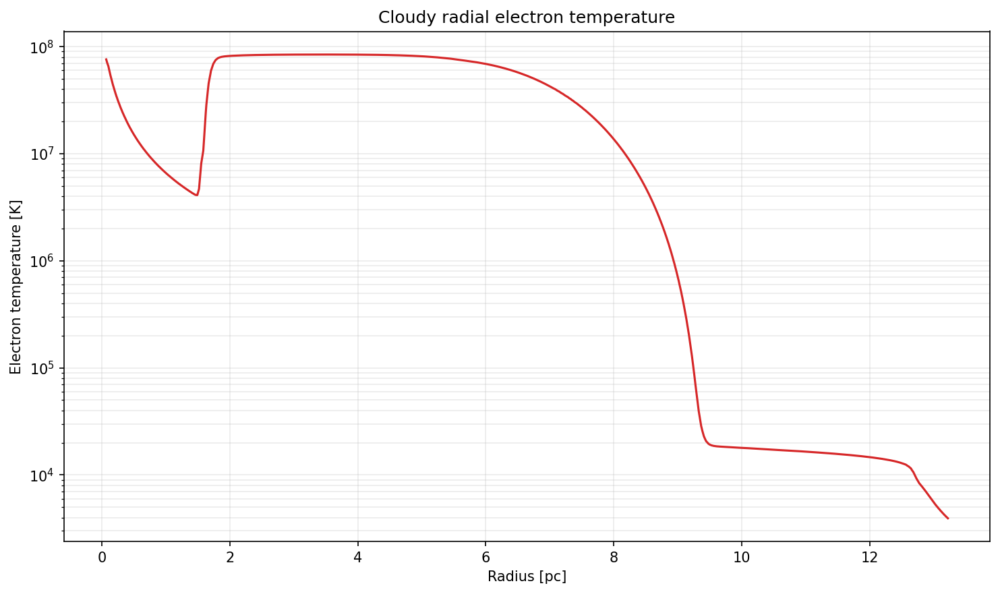
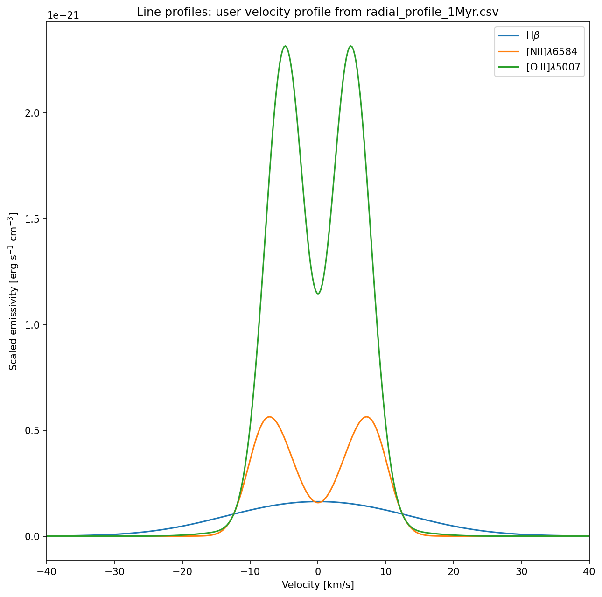
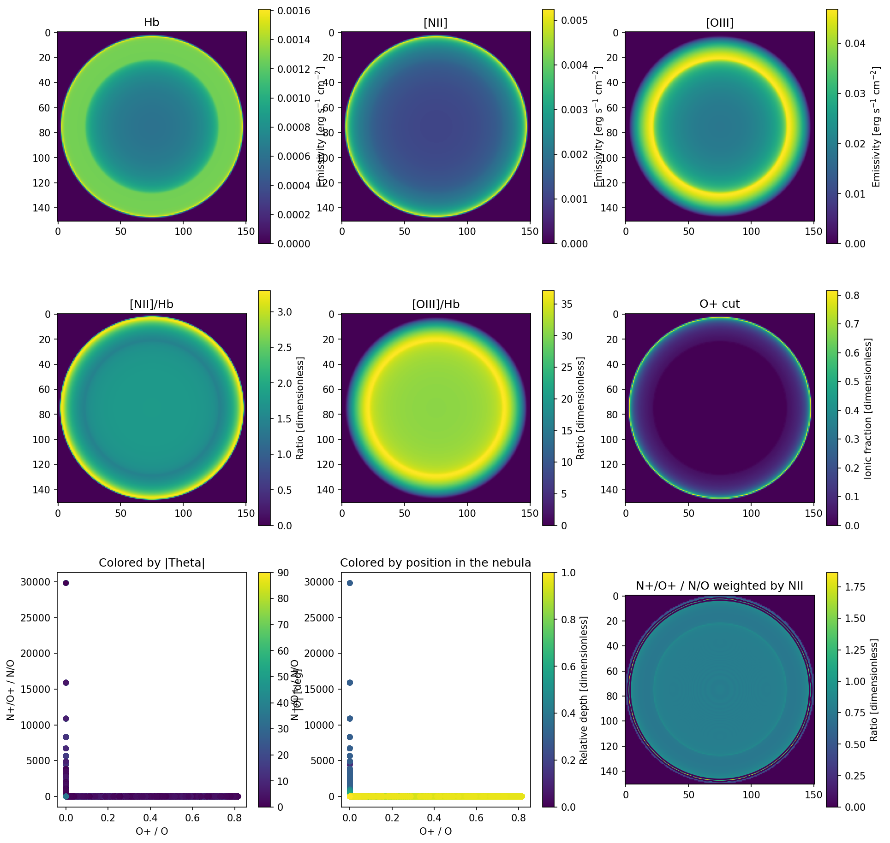
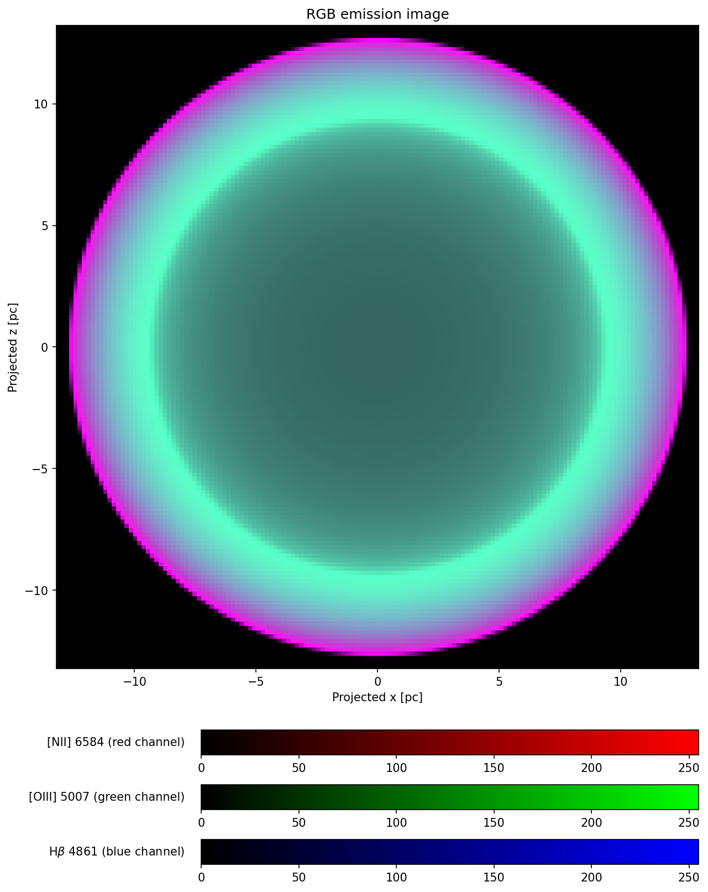
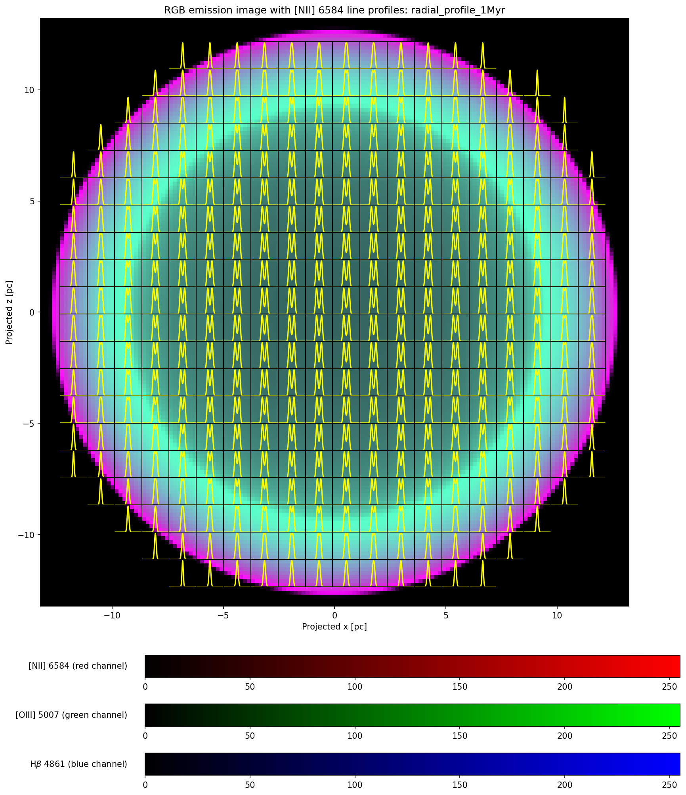
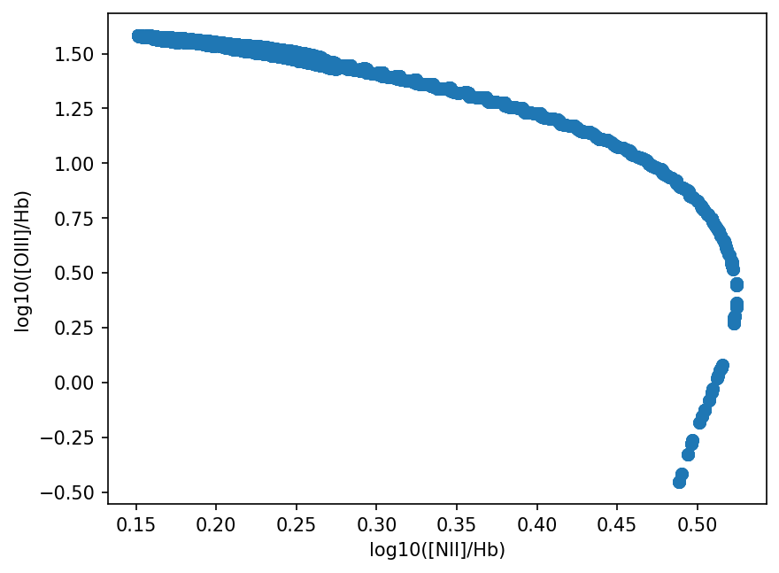

# RHD Stellar-Wind Radial Profiles with Input Temperature

This example is based on
[`Using_pyCloudy_3_spherical_profiles_rhd_wind`](../python_examples/Using_pyCloudy_3_spherical_profiles_rhd_wind/Using_pyCloudy_3_spherical_profiles_rhd_wind.py)
and reads profile CSV files from
[`radial_profiles/`](../python_examples/Using_pyCloudy_3_spherical_profiles_rhd_wind_temperature/radial_profiles/).
The bundled files represent non-zero evolutionary snapshots, including
`radial_profile_0.2Myr.csv` through `radial_profile_1Myr.csv`.

The CSV header is:

```text
RADIUS_PC,VELOCITY_KMS,DENSITY_CM3,TEMP_K
```

Unlike the original wind example, this workflow uses `TEMP_K`. The input
density is passed to Cloudy with `dlaw table radius`, and the input temperature
is converted from Kelvin to Cloudy's `log10(T/K)` table values and passed with
`tlaw table radius`. The velocity profile is applied to C3D as a user-defined
radial velocity field. The model uses `q(H)=10^49 s^-1`. Both `tlaw` table coordinates are logarithmic: radius is
written as `log10(radius/cm)` and temperature as `log10(T/K)`.

The profile CSVs are generated by 1D RHD simulations with the stellar-wind
parameters described in the wind example. This workflow uses the simulated
temperature and density to preprocess the RHD state with Cloudy using the same
`q(H)=10^49 s^-1` source, then uses the simulated velocity in C3D to build the
3D structure and calculate line profiles and projected diagnostics. No Cloudy
`wind` command is added because the wind velocity is supplied by the RHD
profile. The source simulation is the RadHydropy
[`DynamicStromgrenSpherePhotoheating20pcStellarWind1D`](https://github.com/tkc004/RadHydropy/tree/main/example/DynamicStromgrenSpherePhotoheating20pcStellarWind1D)
example.

## Running

```bash
python python_examples/Using_pyCloudy_3_spherical_profiles_rhd_wind_temperature/Using_pyCloudy_3_spherical_profiles_rhd_wind_temperature.py
```

By default, the script runs every CSV in `radial_profiles/` except
`radial_profile_0Myr.csv`. To run one profile explicitly:

```bash
python python_examples/Using_pyCloudy_3_spherical_profiles_rhd_wind_temperature/Using_pyCloudy_3_spherical_profiles_rhd_wind_temperature.py \
  --profile python_examples/Using_pyCloudy_3_spherical_profiles_rhd_wind_temperature/radial_profiles/radial_profile_1Myr.csv
```

The X-ray calculation is disabled by default. Enable it explicitly with:

```bash
python python_examples/Using_pyCloudy_3_spherical_profiles_rhd_wind_temperature/Using_pyCloudy_3_spherical_profiles_rhd_wind_temperature.py --xray
```

Each CSV gets isolated output directories named after its file stem:

```text
python_examples/Using_pyCloudy_3_spherical_profiles_rhd_wind_temperature/
├── figures/<profile-stem>/
└── temp_models/<profile-stem>/
```

The figures include input profiles, Cloudy temperature and line-emissivity
profiles, line profiles, derived maps, RGB images, and diagnostic scatter
plots. X-ray output remains disabled by default; add `--xray` to generate the
optional per-profile X-ray continuum and luminosity plot.

The Cloudy electron-temperature plot uses a logarithmic temperature axis. When
enabled, the example saves and plots the radial X-ray luminosity integrated
over `0.1--10 keV`, sampled every tenth Cloudy zone to limit the continuum
output size.

## Diagnostic Figures

The following gallery shows the output for
`radial_profile_1Myr.csv`. The same set of figures is written into the
corresponding directory for every processed CSV.

### Input RHD Profiles

The plot shows the density and velocity supplied by the RHD simulation. The
density uses the left axis, while the velocity uses the right axis and a
logarithmic scale.



### Cloudy Preprocessing

Cloudy receives the RHD density and temperature profiles and calculates the
photoionization and emissivity structure using `q(H)=10^49 s^-1`. The
temperature plot shows Cloudy's radial electron temperature on a logarithmic
scale. The emissivity plot shows the local Cloudy emissivities before C3D
constructs the Cartesian structure.




### C3D Line Profiles

The user-velocity profile uses the velocity column from the RHD CSV,
interpolated onto the C3D grid. It is extracted along the selected central
line of sight and shows Hbeta, [NII] 6584, and [OIII] 5007.



### Projected Diagnostics

The derived maps show projected Hbeta, [NII], and [OIII] emissivities, their
ratios to Hbeta, an O+ ionic-fraction cut, and additional ionic diagnostics.
For spherical emissivity maps, the script uses supersampled line-of-sight
projection of the Cloudy radial emissivities to avoid numerical radial rings
from coarse Cartesian sampling.



The compact RGB image uses [NII] 6584 in red, [OIII] 5007 in green, and Hbeta
4861 in blue. Each channel is independently normalized and identified by its
color bar.



The overlay version places the [NII] line profile tiles in the same projected
x-z coordinate frame as the RGB image.



The diagnostic scatter plot compares the [NII]/Hbeta and [OIII]/Hbeta ratios
for pixels above the emission threshold.


