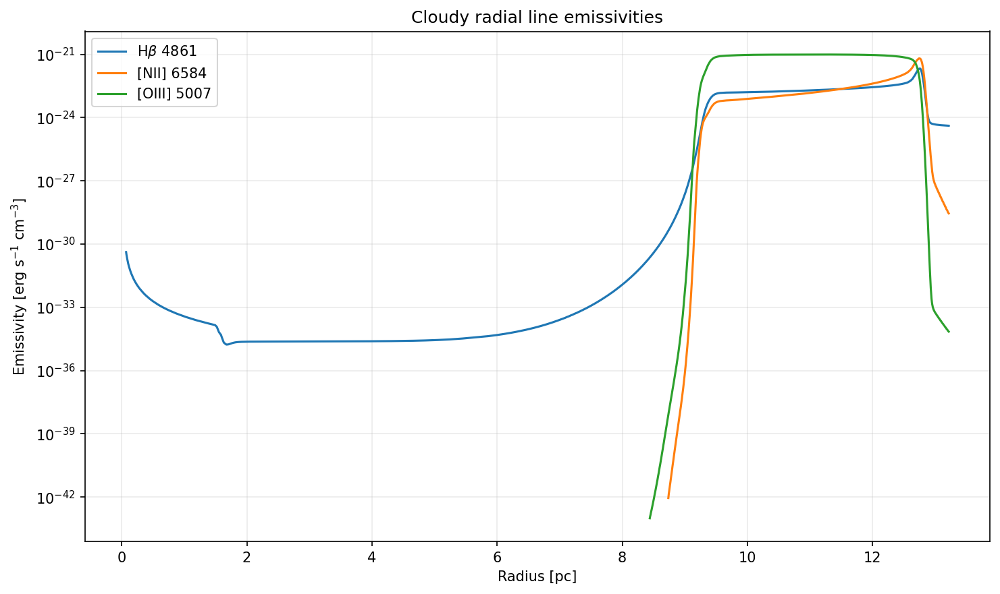

# RHD Stellar-Wind Radial Profiles with Input Temperature

This example is based on
[`Using_pyCloudy_3_spherical_profiles_rhd_wind`](../python_examples/Using_pyCloudy_3_spherical_profiles_rhd_wind/Using_pyCloudy_3_spherical_profiles_rhd_wind.py)
and reads profile CSV files from
[`radial_profiles/`](../python_examples/Using_pyCloudy_3_spherical_profiles_rhd_wind_temperature/radial_profiles/).
The bundled files represent non-zero evolutionary snapshots, including
`radial_profile_0.2Myr.csv` through `radial_profile_1Myr.csv`.

The CSV header is:

```text
RADIUS_PC,VELOCITY_KMS,DENSITY_CM3,TEMP_K
```

Unlike the original wind example, this workflow uses `TEMP_K`. The input
density is passed to Cloudy with `dlaw table radius`, and the input temperature
is converted from Kelvin to Cloudy's `log10(T/K)` table values and passed with
`tlaw table radius`. The velocity profile is applied to C3D as a user-defined
radial velocity field. The model uses `q(H)=10^49 s^-1`. Both `tlaw` table coordinates are logarithmic: radius is
written as `log10(radius/cm)` and temperature as `log10(T/K)`.

## Running

```bash
python python_examples/Using_pyCloudy_3_spherical_profiles_rhd_wind_temperature/Using_pyCloudy_3_spherical_profiles_rhd_wind_temperature.py
```

By default, the script runs every CSV in `radial_profiles/` except
`radial_profile_0Myr.csv`. To run one profile explicitly:

```bash
python python_examples/Using_pyCloudy_3_spherical_profiles_rhd_wind_temperature/Using_pyCloudy_3_spherical_profiles_rhd_wind_temperature.py \
  --profile python_examples/Using_pyCloudy_3_spherical_profiles_rhd_wind_temperature/radial_profiles/radial_profile_1Myr.csv
```

The X-ray calculation is disabled by default. Enable it explicitly with:

```bash
python python_examples/Using_pyCloudy_3_spherical_profiles_rhd_wind_temperature/Using_pyCloudy_3_spherical_profiles_rhd_wind_temperature.py --xray
```

Each CSV gets isolated output directories named after its file stem:

```text
python_examples/Using_pyCloudy_3_spherical_profiles_rhd_wind_temperature/
├── figures/<profile-stem>/
└── temp_models/<profile-stem>/
```

The figures include input profiles, Cloudy temperature and line-emissivity
profiles, line profiles, derived maps, RGB images, and diagnostic scatter
plots. X-ray output remains disabled by default; add `--xray` to generate the
optional per-profile X-ray continuum and luminosity plot.

The Cloudy electron-temperature plot uses a logarithmic temperature axis. When
enabled, the example saves and plots the radial X-ray luminosity integrated
over `0.1--10 keV`, sampled every tenth Cloudy zone to limit the continuum
output size.

For example, the 1 Myr output includes:


