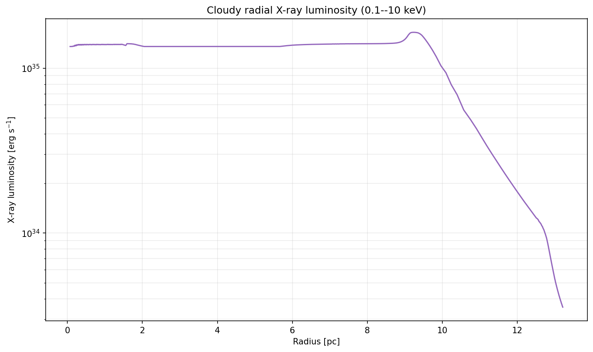

# RHD Stellar-Wind Radial Profiles with Input Temperature

This example is based on
[`Using_pyCloudy_3_spherical_profiles_rhd_wind`](../python_examples/Using_pyCloudy_3_spherical_profiles_rhd_wind/Using_pyCloudy_3_spherical_profiles_rhd_wind.py)
and reads the local
[`radial_profile_rhd_wind.csv`](../python_examples/Using_pyCloudy_3_spherical_profiles_rhd_wind_temperature/radial_profile_rhd_wind.csv).

The CSV header is:

```text
RADIUS_PC,VELOCITY_KMS,DENSITY_CM3,TEMP_K
```

Unlike the original wind example, this workflow uses `TEMP_K`. The input
density is passed to Cloudy with `dlaw table radius`, and the input temperature
is converted from Kelvin to Cloudy's `log10(T/K)` table values and passed with
`tlaw table radius`. The velocity profile is applied to C3D as a user-defined
radial velocity field. Both `tlaw` table coordinates are logarithmic: radius is
written as `log10(radius/cm)` and temperature as `log10(T/K)`.

## Running

```bash
python python_examples/Using_pyCloudy_3_spherical_profiles_rhd_wind_temperature/Using_pyCloudy_3_spherical_profiles_rhd_wind_temperature.py
```

The X-ray calculation is disabled by default. Enable it explicitly with:

```bash
python python_examples/Using_pyCloudy_3_spherical_profiles_rhd_wind_temperature/Using_pyCloudy_3_spherical_profiles_rhd_wind_temperature.py --xray
```

Figures are written under
`python_examples/Using_pyCloudy_3_spherical_profiles_rhd_wind_temperature/figures/`.

The Cloudy electron-temperature plot uses a logarithmic temperature axis. When
enabled, the example saves and plots the radial X-ray luminosity integrated
over `0.1--10 keV`, sampled every tenth Cloudy zone to limit the continuum
output size.


